# **Mini Project: Introduction to Configuration Management in Kubernetes with Kustomize**

## 📘 Project Overview

This project introduces Configuration Management in Kubernetes using **Kustomize**, providing practical skills to manage Kubernetes configurations flexibly and declaratively. Kubernetes acts as the foundation for cloud-native applications, while Kustomize functions like an interior design tool—allowing you to customize and tailor configurations for specific environments without altering the core setup.

**Why is this relevant?**
Imagine building a house where Kubernetes is the foundation and structure, and Kustomize is the interior design tool that customizes each room without changing the building itself. Just as interior design personalizes a house, Kustomize personalizes Kubernetes deployments, making it essential for managing multiple environments and evolving application requirements with ease.

This project empowers learners to understand not just the 'what,' but the 'how' and 'why' of configuration management in Kubernetes—key skills for mastering cloud-native technologies.


## 🧩 Project Goals and Objectives

* Gain familiarity with core Kubernetes objects such as Pods, Deployments, Services, and ConfigMaps.
* Understand the importance of consistent configuration management at scale.
* Learn how Kustomize works as a native Kubernetes tool for managing overlays and customization declaratively.
* Install and verify Kustomize alongside a Kubernetes cluster running locally with Minikube.
* Practice writing Kubernetes manifests and customizing them using Kustomize.
* Build skills to manage multiple environments efficiently using configuration overlays.

## ✅ Prerequisites

1. **Basic Understanding of Kubernetes:** Knowledge of Pods, Deployments, Services, and ConfigMaps.
2. **Docker Installation:** Required for container operations in Kubernetes environments.
3. **kubectl:** Kubernetes CLI tool to interact with clusters.
4. **Minikube:** To run a local single-node Kubernetes cluster for testing.
5. **Kustomize:** Tool for customizing Kubernetes YAML manifests; integrated with kubectl v1.14+.
6. **Code Editor:** Any text editor (recommended: Visual Studio Code) with Kubernetes and YAML support.
7. **Internet Connection:** Needed to download tools and access documentation.
8. **GitHub Account (Optional):** For version control of configurations.
9. **Computer with Adequate Resources:** Minimum 8GB RAM and 2 CPU cores recommended.

## 📦 Project Deliverables

* Sample Kubernetes YAML files, including basic Pod manifests.
* Customized Kubernetes configuration files managed by Kustomize overlays.
* A working local Kubernetes cluster on Minikube.
* Step-by-step documentation of installation and configuration processes.
* Reflections on configuration management principles and Kustomize benefits.

## 🛠 Tools & Technologies Used

* **Kubernetes** (Pods, Deployments, Services, ConfigMaps)
* **Kustomize** (for declarative customization of manifests)
* **Minikube** (local Kubernetes cluster)
* **kubectl** (Kubernetes CLI)
* **Docker** (container engine)
* **Visual Studio Code** (code editor with YAML and Kubernetes extensions)
* **Linux/macOS/Windows** (supported operating systems)

## 🧱 Project Components

1. **Understanding Kubernetes Configuration**

   * Explore Kubernetes documentation and learn about Pods, Deployments, Services, and ConfigMaps.
   * Write a sample Pod YAML manifest (`mypod.yaml`) and understand its structure and importance.

2. **Introduction to Kustomize**

   * Learn about Kustomize’s declarative configuration approach and its integration with kubectl.
   * Understand how Kustomize manages overlays for environment-specific configurations.

3. **Setting Up the Environment**

   * Install Kustomize on your system (detailed Linux installation steps provided).
   * Install and start Minikube to create a local Kubernetes cluster.
   * Verify installation by checking versions of Kustomize and kubectl.

4. **Practical Usage**

   * Use Kustomize to customize and deploy Kubernetes manifests on the Minikube cluster.
   * Reflect on configuration management strategies using Kustomize.


## Lesson 0: Project Setup and Environment Preparation

### Objective

Prepare your working environment by creating the project directory structure, installing necessary tools, and verifying their installations.

### Tasks and Detailed Steps

#### 1. Create Project Directory Structure

* Open your terminal or command prompt.
* Create a root directory for the project `kustomize-k8s-config-management`:

```bash
mkdir kustomize-k8s-config-management
cd kustomize-k8s-config-management
```

**Screenshot:** Create Project Directory
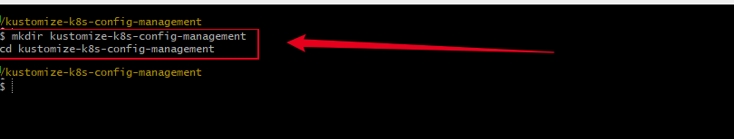

* Inside this directory, create subdirectories to organize your files:

```bash
mkdir -p base
mkdir -p overlays/dev
mkdir -p overlays/prod
mkdir images

# Create empty kustomization.yaml files and sample manifests (optional)
touch base/kustomization.yaml
touch base/mydeployment.yaml
touch base/mypod.yaml

touch overlays/dev/kustomization.yaml
touch overlays/dev/patch.yaml

touch overlays/prod/kustomization.yaml
touch overlays/prod/patch.yaml

# Create README file at the root
touch README.md
```

**Screenshot:** Create Project Subdirectories
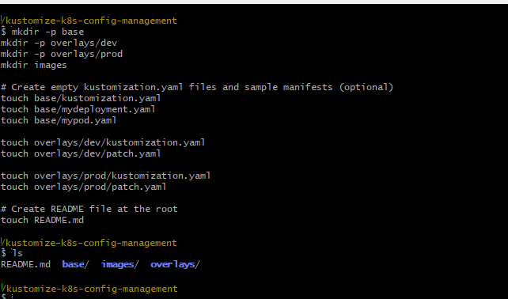

This will set up the exact folder and file structure:

```
kustomize-k8s-config-management/
│
├── base/
│   ├── kustomization.yaml
│   ├── mydeployment.yaml
│   └── mypod.yaml
│
├── overlays/
│   ├── dev/
│   │   ├── kustomization.yaml
│   │   └── patch.yaml
│   │
│   └── prod/
│       ├── kustomization.yaml
│       └── patch.yaml
│
├── images/              # Store diagrams, screenshots, and visuals here
│
└── README.md            # Project overview and documentation
```


#### 2. Install Required Tools

#### 🛠️ Step-by-Step Setup (Windows)

#### 1. **Install Kustomize**

* Go to: [https://kubectl.docs.kubernetes.io/installation/kustomize/](https://kubectl.docs.kubernetes.io/installation/kustomize/)
* Download latest `kustomize` release for Windows.
* Unzip and move `kustomize.exe` to a folder like `C:\Tools\kustomize`.
* Add that folder to your **System PATH**.

**Verify:**

```bash
kustomize version
```

**Screenshot:** Kustomize Version
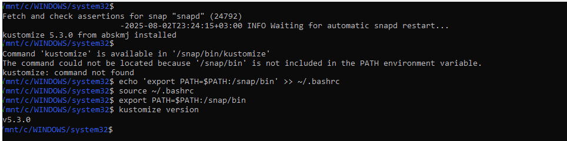

#### 2. **Install kubectl**

* Guide: [Install kubectl on Windows](https://kubernetes.io/docs/tasks/tools/install-kubectl-windows/)
* Download `kubectl.exe`
* Move to `C:\Tools\kubectl` and add to PATH.

**Verify:**

```bash
kubectl version --client
```

**Screenshot:**  Kubectl Version --client
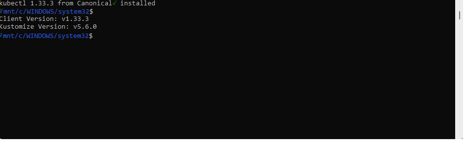

### 3. **Install Minikube (Without Docker Desktop)**

#### ⬇️ Option A: Use **Hyper-V** or **VirtualBox**

> Check your BIOS to enable virtualization, then:

* Download Minikube: [https://minikube.sigs.k8s.io/docs/start/](https://minikube.sigs.k8s.io/docs/start/)
* Install **VirtualBox** or use **Hyper-V** if you're on Windows Pro.

**Start Minikube:**

```bash
minikube start --driver=virtualbox
```

**Screenshot:** Minikube Start
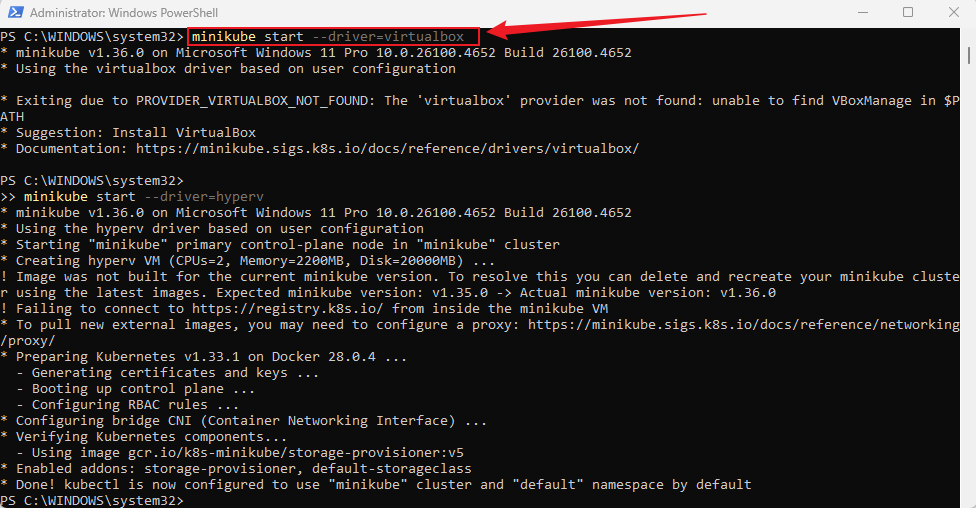

> 💡 **Note:**  
> You do **not** need to install Docker Desktop to run this project.  
> This Kustomize project is focused on managing and deploying Kubernetes manifests using tools like `kubectl`, `kustomize`, and `Minikube`.  
> 
> Since we are not building or pushing Docker images in this project, Docker Desktop is **not required**.  
> 
> ⚠️ Additionally, Docker Desktop can be **resource-heavy** and may not run smoothly on entry-level processors like Intel Celeron N4020.  
> That's why we use **Minikube with VirtualBox or Hyper-V** to simulate a Kubernetes cluster locally.

### 4. **Install VS Code (Recommended)**

* Download from [https://code.visualstudio.com/](https://code.visualstudio.com/)
* Install extensions:

  * **Kubernetes**
  * **YAML**
  * **Docker** (optional)

**Screenshot:** VS Code Display
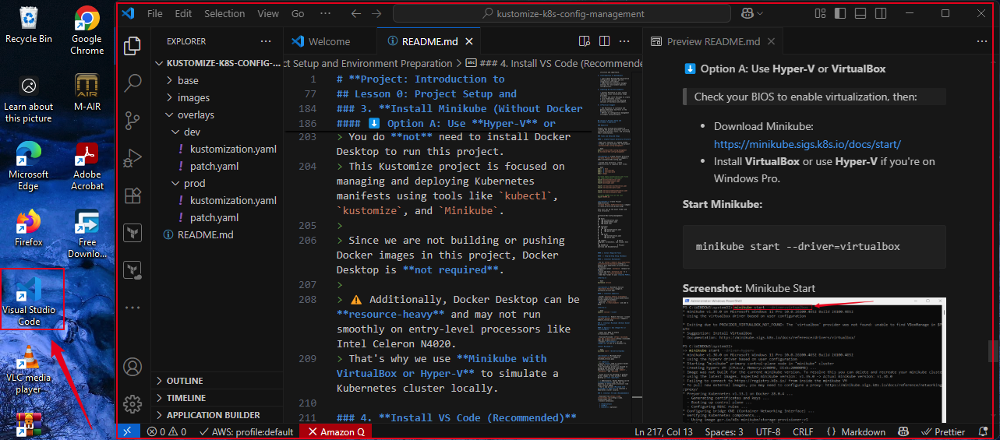

## 📘 Lesson 1.1: Understanding Kubernetes Configuration

### 🎯 **Objective**

Familiarize yourself with core Kubernetes objects and how to define them using YAML configuration files.

### ✅ **Tasks and Detailed Steps**

#### 🔍 1. Explore Kubernetes Documentation

* Visit the official [Kubernetes Objects Overview](https://kubernetes.io/docs/concepts/overview/working-with-objects/kubernetes-objects/).
* Focus on understanding the following key objects:

  * **Pod** – Smallest deployable unit
  * **Deployment** – Manages ReplicaSets and ensures pod availability
  * **Service** – Exposes an application as a network service
  * **ConfigMap** – Used to store non-sensitive configuration data


#### 📝 2. Write a Sample Pod YAML File

> This step will help you understand how to structure a Kubernetes manifest file for a basic pod.

#### 🔧 Create the file:

```bash
touch mypod.yaml
```

#### ✍️ Insert the following content:

```yaml
apiVersion: v1
kind: Pod
metadata:
  name: mypod
spec:
  containers:
    - name: mycontainer
      image: nginx
```

> ✅ **Note:** Ensure proper indentation using 2 spaces to avoid errors when applying the configuration.

#### 💬 3. Discussion & Reflection

* **Why is this important?**
  As you deploy applications in Kubernetes, managing configurations manually across many resources becomes complex and error-prone.

* **What’s the solution?**
  By defining your infrastructure and app components as code (IaC), you achieve:

  * Version control
  * Reusability
  * Consistency
  * Easier rollbacks and troubleshooting

## 📘 Lesson 1.2: Applying a Pod YAML on Minikube

### 🎯 **Objective**

Deploy the sample `mypod.yaml` configuration file to your local Minikube Kubernetes cluster and verify that it runs successfully.

#### ✅ **Prerequisites**

Ensure you’ve completed the following:

* Installed **Minikube**
* Installed **kubectl**
* Started your Minikube cluster

```bash
minikube start
```

**Screenshot:** Minikube Start


### 🛠️ **Step-by-Step Instructions**


#### 1. ⬆️ Apply the YAML Configuration

From your terminal (where `mypod.yaml` is saved), run:

```bash
kubectl apply -f mypod.yaml
```

> ✅ This command sends the manifest to the Kubernetes API server, which schedules and creates the Pod.


#### 2. 🔍 Check the Pod Status

Run:

```bash
kubectl get pods
```

Expected output should show something like:

```bash
NAME     READY   STATUS    RESTARTS   AGE
mypod    1/1     Running   0          10s
```

**Screenshot:** Kubectl Get Pods
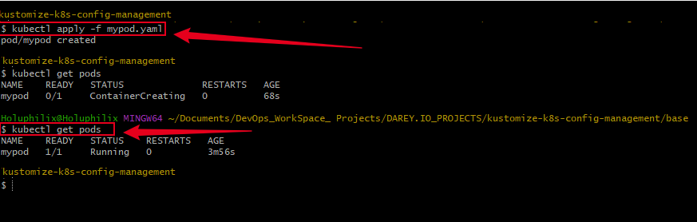

#### 3. 📂 Inspect Pod Details

```bash
kubectl describe pod mypod
```

Look through the output to see:

* Pod events
* Image used (`nginx`)
* Container status
* Node assignment

**Screenshot:** kubectl describe pod mypod
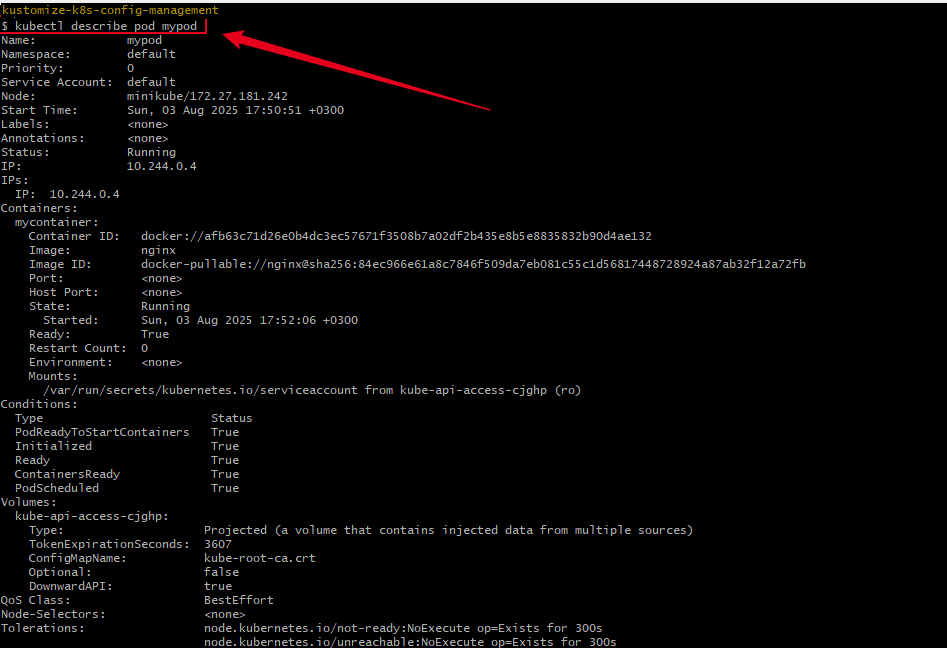

## 📘 **Lesson 1.3: Introduction to Kustomize**

### 🎯 **Objective**

Understand what Kustomize is and begin using it with your existing Pod YAML to experience its power in customizing Kubernetes objects **without modifying the original files**.


**Key Points:**
- Kustomize enables declarative configuration management.
- It supports overlays for environment-specific customizations (e.g., dev, prod).
- It’s integrated with kubectl (no separate tool needed for basic use).

### 🛠️ **Step-by-Step Guide**

#### 1. ✅ Start With Your Existing Pod

You already have `mypod.yaml`. We'll now Kustomize it.

#### 2. 🧱 Create a `kustomization.yaml` in the Same Folder

Assuming you're in the `base/` folder:

```bash
cd base/
touch kustomization.yaml
```

Now open it and add the following:

```yaml
resources:
  - mypod.yaml
```

This file tells Kustomize to manage `mypod.yaml`.

#### 3. ▶️ Run Kustomize

Now run this command from the `base/` directory:

```bash
kustomize build .
```

**Screenshot:** kustomize build .
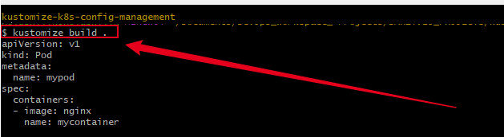

✅ This confirms Kustomize is working — it built the manifest by loading your `mypod.yaml`.

#### 4. 🚀 Apply the Manifest via Kustomize

Instead of manually applying `mypod.yaml`, now do:

```bash
kubectl apply -k .
```

This applies everything managed in `kustomization.yaml`.

#### 5. 🔍 Confirm the Pod Was Deployed

Run again:

```bash
kubectl get pods
```

You should see `mypod` running again.

**Screenshot:** kubectl get pods (kustomize)
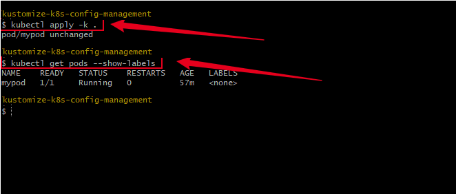

### 📌 Summary of What You Just Did:

| Step                         | What It Demonstrates                        |
| ---------------------------- | ------------------------------------------- |
| Created `kustomization.yaml` | Introduced Kustomize’s base config format   |
| Ran `kustomize build`        | Showed how Kustomize assembles the YAML     |
| Applied with `kubectl -k`    | Proved integration with the Kubernetes tool |

## **Lesson 1.4: Enhancing Reusability with `commonLabels` and Image Customization**

**In your `base/` folder**, where your `mypod.yaml` lives:

#### 🧾 Step 1: Add `commonLabels` and `images` to your `kustomization.yaml`

My current `kustomization.yaml` looks like this:

```yaml
apiVersion: kustomize.config.k8s.io/v1beta1
kind: Kustomization
resources:
- mypod.yaml
```

Update it to:

```yaml
apiVersion: kustomize.config.k8s.io/v1beta1
kind: Kustomization

resources:
  - mypod.yaml

commonLabels:
  app: nginx

images:
  - name: nginx
    newTag: "1.21"
```

#### 🧪 Step 2: Rebuild with Kustomize

In your terminal:

```bash
kustomize build .
```

**Screenshot:** kustomize rebuild 
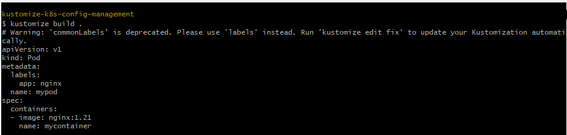
* The `nginx` image now uses `nginx:1.21`
* The label `app: nginx` applied to the pod metadata

#### 3. 🚀 Re-apply the updated configuration via Kustomize

```bash
kubectl apply -k .
```

This applies everything managed in `kustomization.yaml`.

#### 4. 🔍 Confirm the Pod Was Deployed

Run again:

```bash
kubectl get pods
```

You should see `mypod` running again.

**Screenshot:** kubectl get pods (kustomize)


## **Lesson 1.5: Creating and Managing a Deployment with Kustomize**

#### 📄 **Step 1: Create a basic `mydeployment.yaml`**

Add this content inside `base/mydeployment.yaml`:

```yaml
apiVersion: apps/v1
kind: Deployment
metadata:
  name: mydeployment
spec:
  replicas: 2
  selector:
    matchLabels:
      app: nginx
  template:
    metadata:
      labels:
        app: nginx
    spec:
      containers:
      - name: nginx
        image: nginx:latest
        ports:
        - containerPort: 80
```

#### 🛠️ **Step 2: Update your `base/kustomization.yaml`**

Add `mydeployment.yaml` to the list of resources:

```yaml
apiVersion: kustomize.config.k8s.io/v1beta1
kind: Kustomization
resources:
  - mypod.yaml
  - mydeployment.yaml
```

#### 🔧 **Step 3: Rebuild mydeployment.yaml with Kustomize and Apply**

```bash
kustomize build .
kubectl apply -k .
```

**Screenshot:** Re-apply kustomize build 
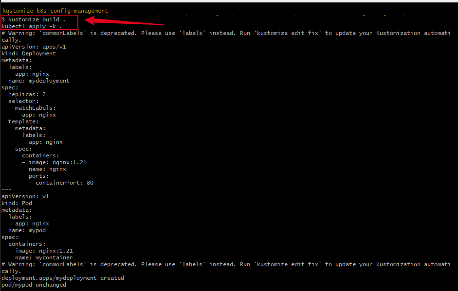

#### 🔍 **Step 4: Verify**

```bash
kubectl get pods
kubectl get deployment mydeployment
kubectl describe deployment mydeployment
```

You should see two running Pods managed by the new `mydeployment`.

**Screenshot:** Kubectl get pods, deployment & describe 
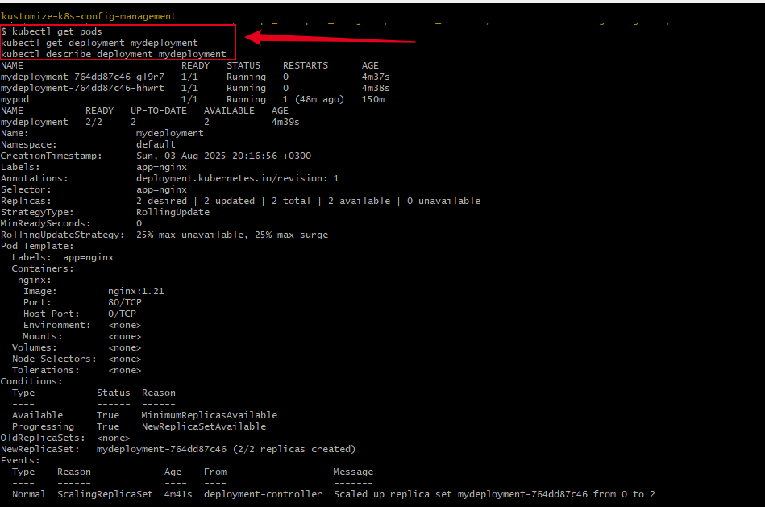


## **Lesson 2: Creating a Patch with Overlays in Kustomize**

### **Goal:**

Use a `patch.yaml` file in `overlays/dev/` to override the image version in the `base/mydeployment.yaml`.

We’ll update `nginx:1.21` → `nginx:1.25` using a strategic patch.

#### 📁 Project Structure After Lesson 2:

```
kustomize-k8s-config-management/
├── base/
│   ├── kustomization.yaml
│   └── mydeployment.yaml
├── overlays/
│   └── dev/
│       ├── kustomization.yaml
│       └── patch.yaml
```

#### ✍️ Step 1: Create `patch.yaml` in `overlays/dev/`

**File: `overlays/dev/patch.yaml`**

```yaml
apiVersion: apps/v1
kind: Deployment
metadata:
  name: mydeployment
spec:
  template:
    spec:
      containers:
      - name: nginx
        image: nginx:1.25
```

#### ✍️ Step 2: Create `kustomization.yaml` in `overlays/dev/`

**File: `overlays/dev/kustomization.yaml`**

```yaml
resources:
  - ../../base

patchesStrategicMerge:
  - patch.yaml
```

#### Step 3: Deploy the Overlay

Run this command:

```bash
kubectl apply -k .
```

**Screenshot:** Deploy the Overlay
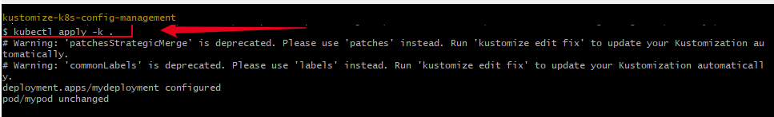

#### 🔍 Step 4: Confirm the Patch Worked

Run:

```bash
kubectl describe deployment mydeployment
```
**Screenshot:** kubectl describe deployment
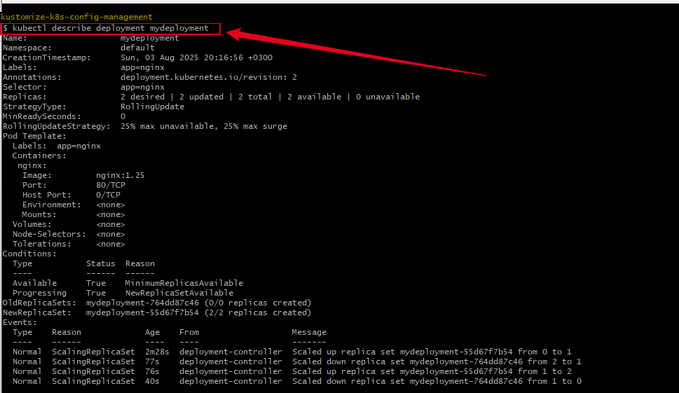


## **Lesson 3: Using ConfigMapGenerator with Kustomize**

### Objective:

* Learn how to generate and manage ConfigMaps declaratively with Kustomize.
* Update your base `kustomization.yaml` to include `configMapGenerator`.
* Apply your changes to the cluster.

### Step-by-step for Lesson 3 only:

1. **Update your base `kustomization.yaml`** (in `base/` folder):

```yaml
apiVersion: kustomize.config.k8s.io/v1beta1
kind: Kustomization

resources:
  - mypod.yaml
  - mydeployment.yaml

configMapGenerator:
  - name: app-config
    envs:
      - config.env

commonLabels:
  app: nginx

images:
  - name: nginx
    newTag: "1.21"
```

2. **Create the `config.env` file** in the `base/` folder:

Content:

```
APP_COLOR=blue
APP_MODE=development
```

3. **Update `mydeployment.yaml` to mount or consume the ConfigMap** 

```yaml
apiVersion: apps/v1
kind: Deployment
metadata:
  name: mydeployment
spec:
  replicas: 2
  selector:
    matchLabels:
      app: nginx
  template:
    metadata:
      labels:
        app: nginx
    spec:
      containers:
      - name: nginx
        image: nginx               # ← No tag, so Kustomize can patch it
        ports:
        - containerPort: 80
        envFrom:
        - configMapRef:
            name: app-config      # ← Refers to configMapGenerator 
```

4. **Apply the base configuration:**

```bash
$ kustomize build . | kubectl apply -f -
```

**Screenshot:** kubectl apply configmap
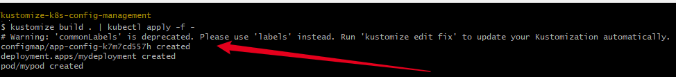

5. **Verify ConfigMap is created:**

```bash
kubectl get configmap
kubectl describe configmap app-config
```

**Screenshot:** kubectl get configmap
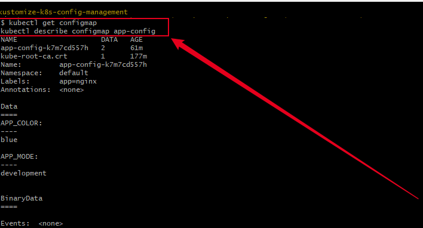


## **Lesson 4: Managing Environment-Specific ConfigMaps with Kustomize Overlays**

### 🎯 Objective

Learn how to customize configuration data for different environments (`dev` and `prod`) by overriding ConfigMaps in Kustomize overlays using environment-specific `config.env` files.

### 📁 Project Structure Recap

```
kustomize-k8s-config-management/
├── base/
│   ├── kustomization.yaml
│   ├── mydeployment.yaml
│   ├── mypod.yaml
│   └── config.env
├── overlays/
│   ├── dev/
│   │   ├── kustomization.yaml
│   │   ├── patch.yaml
│   │   └── config.env
│   └── prod/
│       ├── kustomization.yaml
│       ├── patch.yaml
│       └── config.env
├── images/
└── README.md
```

#### 🔧 Step 1: Create environment-specific `config.env` files in overlays

#### For **dev** environment:

`overlays/dev/config.env`:

```env
ENV=development
LOG_LEVEL=debug
```

#### For **prod** environment:

Create `overlays/prod/config.env`:

```env
ENV=production
LOG_LEVEL=error
```

#### ✍️ Step 2: `overlays/prod/kustomization.yaml`

```yaml
apiVersion: kustomize.config.k8s.io/v1beta1
kind: Kustomization

resources:
  - ../../base

configMapGenerator:
  - name: app-config
    envs:
      - config.env

patchesStrategicMerge:
  - patch.yaml

labels:
  environment: prod
```

#### ✍️ Step 3: `overlays/prod/patch.yaml`

This patch can override base settings such as the nginx image tag for prod:

```yaml
apiVersion: apps/v1
kind: Deployment
metadata:
  name: mydeployment
spec:
  template:
    spec:
      containers:
      - name: nginx
        image: nginx:1.28   # Different image tag for production
```

#### 🔍 Step 4: Verify `base/kustomization.yaml`

Ensure your base does **not** define the `configMapGenerator` for `app-config` or be aware it will be overridden by overlays.

Example:

```yaml
apiVersion: kustomize.config.k8s.io/v1beta1
kind: Kustomization

resources:
  - mypod.yaml
  - mydeployment.yaml

labels:
  app: nginx

images:
  - name: nginx
    newTag: "1.21"
```

#### 🚀 Step 5: Deploy overlays and apply changes after changing label:

Apply **dev** overlay:

```bash
kubectl apply -k overlays/dev
```

Apply **prod** overlay:

```bash
kubectl apply -k overlays/prod
```
**Screenshot:** Deploy Overlays
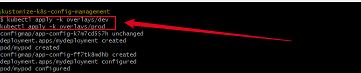

#### 🔍 Step 6: Verify ConfigMaps and Pod environment variables for each environment

List ConfigMaps:

```bash
kubectl get configmaps
```

**Screenshot:** kubectl get configmaps
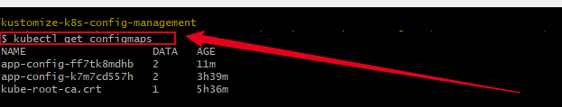


Check Pod environment variables (replace `<pod-name>` with your pod):

```bash
kubectl describe configmap app-config-ff7tk8mdhb
kubectl describe configmap app-config-k7m7cd557h
```
**Screenshot:** kubectl describe configmaps
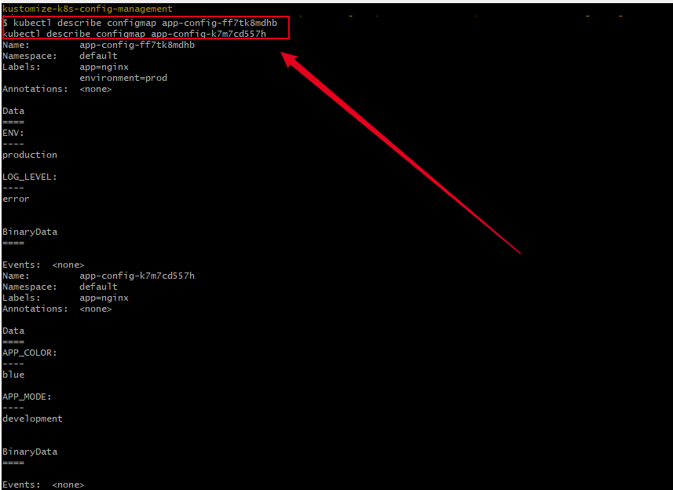

#### 💡 Summary

* Overlays have environment-specific `config.env` files to manage config data.
* Overlays generate ConfigMaps that override or extend base configs.
* You can patch deployments (e.g., change nginx image tags) per environment.
* This modular approach keeps your Kubernetes configs clean, flexible, and environment-aware.
* Apply each overlay separately depending on the target environment.

## 📘 **Lesson 4.2 — Migrating from `commonLabels` to `labels` in Kustomize**

#### 🧾 Objective

In this section, we refactor the Kustomize configuration by replacing the deprecated `commonLabels` field with the updated `labels` field. This ensures compatibility with the latest Kustomize versions and avoids warnings or unexpected behavior during deployment.

#### 🛠️ Problem with `commonLabels`

When applying the `kustomization.yaml`, we received the following warning:

```bash
Warning: 'commonLabels' is deprecated. Please use 'labels' instead. Run 'kustomize edit fix' to update your Kustomization automatically.
```

This indicates that the `commonLabels` field is outdated and will be removed in future versions. Continuing to use deprecated fields may result in:

* Incompatibility with future Kustomize releases
* Broken CI/CD workflows
* Unexpected behavior during resource generation


#### ✅ Solution — Migrating to `labels`

We updated our Kustomization files to use the recommended `labels` field.

**Before (deprecated):**

```yaml
commonLabels:
  app: nginx
```

**After (recommended):**

```yaml
labels:
  app: nginx
```

The `labels` field provides the same functionality as `commonLabels`, applying a label to all generated resources, but aligns with the latest Kustomize specifications.

**Apply after changes:**

```bash
kubectl apply -k overlays/dev
kubectl apply -k overlays/prod
```

#### 📸 Screenshot — Successful Deployment
**Screenshot:** Successful Deployment Overlays

💡 *Tip: Show both `dev` and `prod` outputs and the resource creation.*

#### 🧠 Key Takeaways

* Using deprecated fields like `commonLabels` can cause warnings or future failures.
* Kustomize v5+ recommends using the `labels` field for applying common metadata.
* Always keep configuration files updated to reflect best practices and improve compatibility.

## Lesson 5: Adding Resource Requests & Limits with Kustomize Overlays and Confirming Consistency

### 🎯 Objective

Learn how to add resource requests and limits to your Kubernetes Deployment using Kustomize overlays, deploy those changes, and verify the configuration is applied correctly with consistent image versions and proper pod behavior.

#### Step 1: Update Production Patch to Include Resource Requests and Limits

In your production overlay patch (`overlays/prod/patch.yaml`), update the container spec to:

```yaml
apiVersion: apps/v1
kind: Deployment
metadata:
  name: mydeployment
spec:
  template:
    spec:
      containers:
      - name: mycontainer
        image: nginx:1.28   # Use the desired image tag for prod
        resources:
          limits:
            cpu: "0.5"
            memory: "512Mi"
          requests:
            cpu: "0.2"
            memory: "256Mi"
```

> **Note:**
> Make sure the container name (`mycontainer`) matches exactly the name in your base deployment YAML.

#### Step 2: Apply the Production Overlay

Run the following command from your project root or inside the `overlays/prod` directory:

```bash
kubectl apply -k overlays/prod
```

**Screenshot:** kubectl apply -k overlays/prod
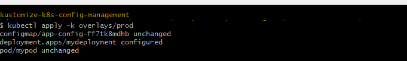

This applies the production overlay, including your resource limits and requests.

Yes, I would recommend updating this step slightly for **clarity**, **accuracy**, and **alignment with `kustomization.yaml` usage**. The use of `kubectl edit` is not the best practice when you're managing Kubernetes manifests declaratively with Kustomize. Instead, it’s better to **edit the actual `base/mydeployment.yaml` file directly** and let Kustomize handle the image substitution.

#### Step 3: Confirm Image Consistency in Base Deployment

Ensure your base deployment manifest (`base/mydeployment.yaml`) uses a generic image reference so that `kustomization.yaml` can override it.

Open the file and confirm the container section looks like this:

```yaml
containers:
- name: mycontainer
  image: nginx
```

This allows `kustomization.yaml` to replace the image tag using the `images:` field:

```yaml
images:
  - name: nginx
    newTag: "1.28"
```

> ✅ **Note:** Avoid hardcoding version tags like `nginx:1.28` in your base files. Let Kustomize handle that dynamically through the `images` field in `kustomization.yaml`.

#### 🔁 Why this change?

* You’re using the `images:` transformer in `kustomization.yaml` to set the tag.
* Having `nginx:1.28` hardcoded in `mydeployment.yaml` defeats the purpose of using Kustomize to manage versions.
* `kubectl edit` edits live objects, not files — and you’re clearly working with a declarative GitOps-style setup.

```bash
kubectl edit deployment mydeployment
```
**Screenshot:** kubectl edit deployment mydeployment
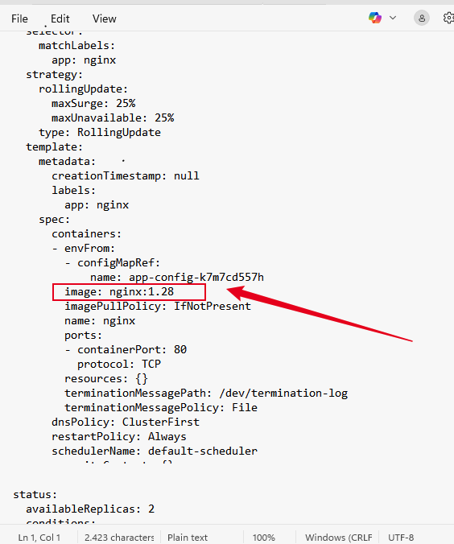

#### Step 4: Reapply Production Overlay to Confirm

Re-run:

```bash
kubectl apply -k overlays/prod
```

#### Step 5: Monitor Logs of Pods and Deployments

To monitor logs of your manually created pod (`mypod`):

```bash
kubectl logs mypod -f --since=1h --tail=500
```

To monitor logs of one of the deployment pods (example using your pod name):

```bash
kubectl logs mydeployment-64f5688989-f9ccg -f --since=35m --tail=500
```
**Screenshot:** kubectl logs
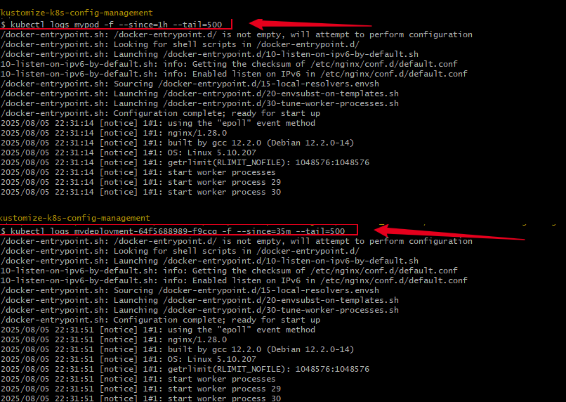

#### Step 6: Restart Pods to Apply Changes (Optional but Recommended)

If you want to ensure pods pick up the latest configurations:

Delete the manual pod:

```bash
kubectl delete pod mypod
```

Then check that new pods are running:

```bash
kubectl get pods --show-labels
```

Wait a few seconds, and confirm that the pod is recreated or that deployment pods are running.

### Summary

In this lesson, I :

* Added resource requests and limits to your deployment via a patch in Kustomize overlays.
* Applied the production overlay to your cluster.
* Verified consistency between base deployment and overlays for image versions.
* Used `kubectl` commands to monitor pod logs and pod lifecycle.
* Learned to restart pods manually to ensure changes take effect.
* Confirmed resource constraints are respected in the running pods.

This process strengthens your ability to manage complex Kubernetes configurations declaratively and verify your changes effectively.

### 🛑 Stop and Delete Minikube

When you're done working with your Minikube cluster, it's a good practice to stop it to free up system resources, or delete it completely if you no longer need it.

#### 🔸 Stop Minikube

This will shut down the Minikube VM but retain your cluster state and configuration:

```bash
minikube stop
```

**Screenshot:** minikube stop
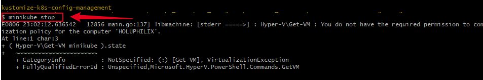

#### 🔸 Delete Minikube

This will remove the entire Minikube cluster and all associated configurations:

```bash
minikube delete
```

**Screenshot:** minikube delete
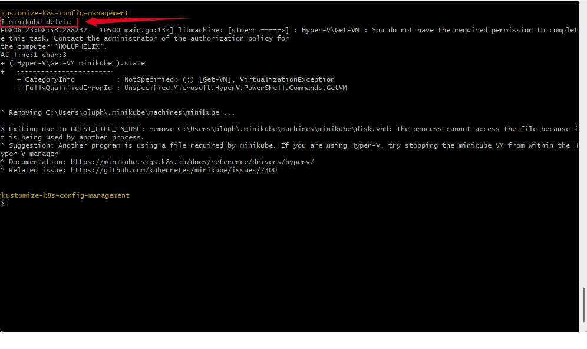

### Step-by-Step Guide to Push to GitHub

#### 1. **Initialize Git (if not already initialized)**

If you haven’t already done so:

```bash
git init
```

#### 2. **Check Git Status**

```bash
git status
```

This shows untracked or changed files.

#### 3. **Add All Files**

```bash
git add .
```

#### 4. **Commit the Changes**

```bash
git commit -m "Initial commit: Kubernetes configuration management with Kustomize"
```

#### 5. **Add Remote Origin**

If this is your **first push** to a new repo:

```bash
git remote add origin https://github.com/Shegezzy/kustomize-k8s-config-management.git
```

#### 6. **Push to GitHub**

For the default branch `main`:

```bash
git branch -M main
git push -u origin main
```

## Conclusion

In this project, we successfully demonstrated how to manage Kubernetes configurations using **Kustomize**. By leveraging the power of declarative management and layered customization, we were able to:

* Create a base configuration for a Kubernetes deployment.
* Apply environment-specific customizations using Kustomize overlays.
* Update image versions and resource specifications cleanly.
* Monitor logs and troubleshoot pod issues.
* Restart and verify deployments as needed.
* Properly shut down and clean up the Minikube environment.

This hands-on approach not only reinforces fundamental Kubernetes concepts but also emphasizes the value of **infrastructure as code** and **modular configuration management** in a DevOps workflow. As you scale your applications and environments, tools like Kustomize become essential for maintaining clarity, flexibility, and reusability in your deployments.

## 👤 Author

**Olusegun Akinnola**
🌍 DevOps Engineer | Cloud Enthusiast
📫 [shegezzy@gmail.com](mailto:shegezzy@gmail.com)
💼 [GitHub: Shegezzy](https://github.com/shegezzy)
🔗 [LinkedIn: Philip Oluwaseyi Oludolamu](https://www.linkedin.com/in/olusegunakinnola/)
🌐 Passionate about automating infrastructure, continuous delivery, and building scalable DevOps pipelines.
